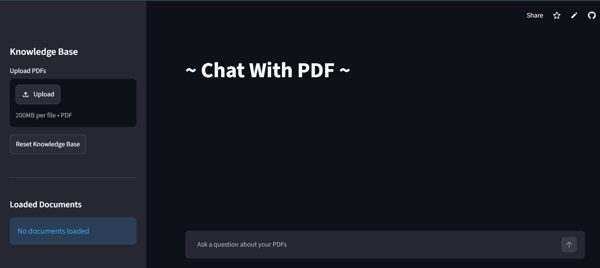
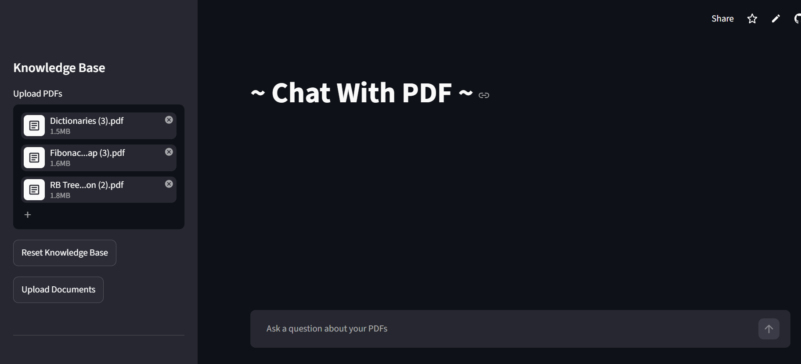
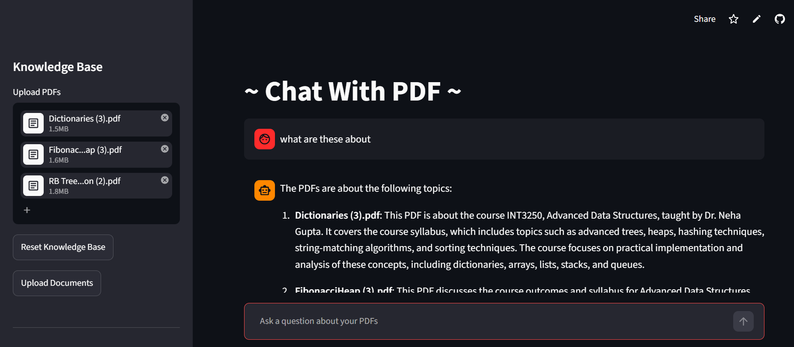
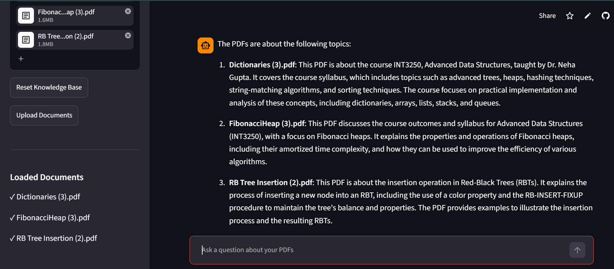
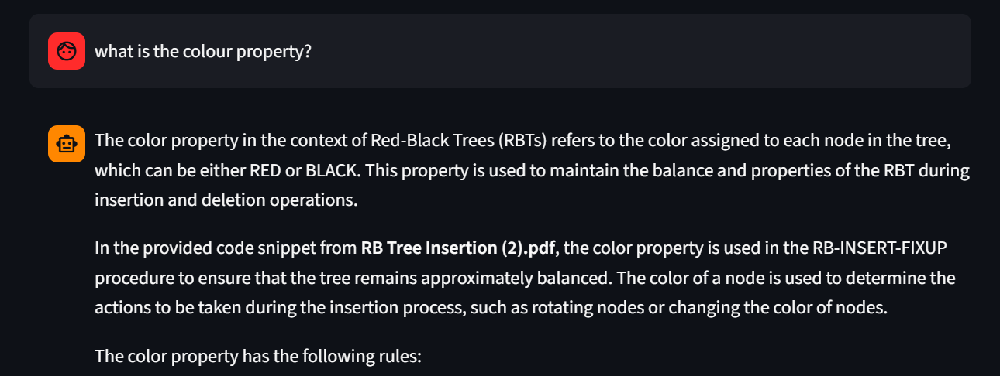
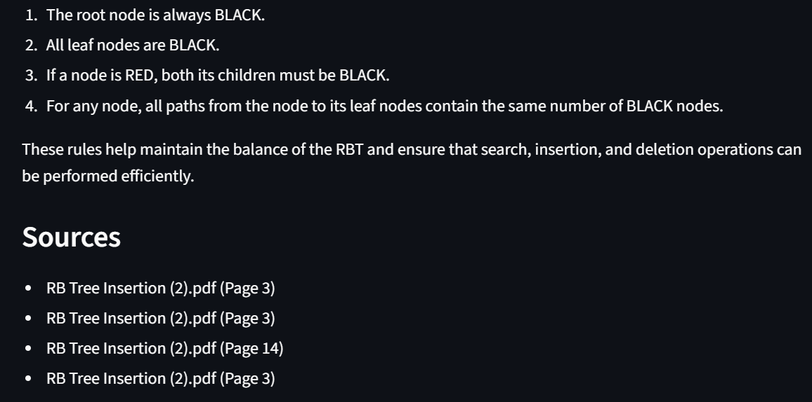
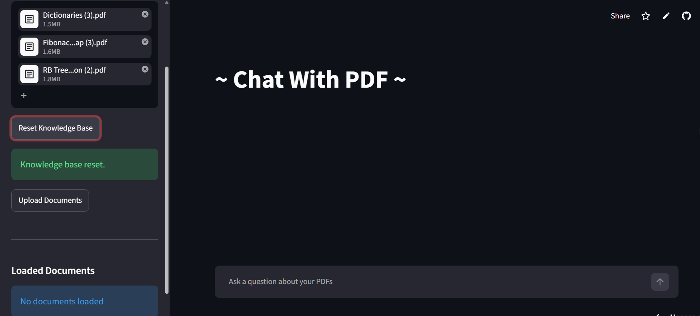

# 📄 Chat With PDF

### AI-Powered Multi-Document PDF Assistant using RAG, LangChain, ChromaDB & Groq

Chat With PDF is a Retrieval-Augmented Generation (RAG) application that allows users to upload one or more PDF documents and interact with them using natural language.

The application automatically:

* Extracts PDF content
* Generates embeddings
* Stores vectors in ChromaDB
* Retrieves relevant document chunks
* Uses Groq-hosted LLMs for question answering
* Supports multi-document understanding
* Provides source citations for transparency

---

## Live Demo

### Streamlit Deployment

```text
https://chatt-with-pdf.streamlit.app/
```

## Home Screen



---

## Features

### PDF Knowledge Base

Upload one or multiple PDFs and create an instant searchable knowledge base.



### Retrieval-Augmented Generation (RAG)

The application retrieves relevant document chunks before generating answers.

### Multi-Document Support

Ask questions across multiple PDFs:

* Summarize all documents
* Compare documents
* Retrieve information from multiple sources





### Groq LLM Integration

Powered by:

* Llama 3.3 70B Versatile
* Groq Inference API





### Source Citations

Every answer includes:

* Source PDF
* Page references

### Knowledge Base Reset

Clear uploaded PDFs and vector embeddings with one click.



### Conversational Interface

Streamlit chat interface with persistent session history.

---

# Architecture

```text
User
 │
 ▼
Streamlit UI
 │
 ▼
PDF Upload
 │
 ▼
PDF Processing
 │
 ▼
Chunking
 │
 ▼
Embeddings
 │
 ▼
ChromaDB
 │
 ▼
Retriever
 │
 ▼
Groq LLM
 │
 ▼
Answer + Sources
```

---

# Tech Stack

| Component       | Technology            |
| --------------- | --------------------- |
| Frontend        | Streamlit             |
| LLM             | Groq (Llama 3.3 70B)  |
| Framework       | LangChain             |
| Vector Database | ChromaDB              |
| Embeddings      | Sentence Transformers |
| PDF Parsing     | PyPDF                 |
| Language        | Python                |

---

# Project Structure

```text
chat-with-pdf/
│
├── app.py
│
├── services/
│   ├── rag_service.py
│   ├── vectorstore_service.py
│   ├── embedding_service.py
│   ├── document_service.py
│   ├── pdf_service.py
│   └── ingest.py
│
├── data/
│   └── uploads/
│
├── chroma_db/
│
├── requirements.txt
│
└── README.md
```

---

# Local Installation

## 1. Clone Repository

```bash
git clone https://github.com/tejashree2405/chat-with-pdf.git

cd chat-with-pdf
```

---

## 2. Create Virtual Environment

### Windows

```bash
python -m venv venv

venv\Scripts\activate
```

### Linux / Mac

```bash
python3 -m venv venv

source venv/bin/activate
```

---

## 3. Install Dependencies

```bash
pip install -r requirements.txt
```

---

## 4. Configure Groq API Key

Create:

```text
.streamlit/secrets.toml
```

Add:

```toml
GROQ_API_KEY = "your_groq_api_key_here"
```

You can obtain a key from:

```text
https://console.groq.com/keys
```

---

## 5. Run Application

```bash
streamlit run app.py
```

Application will start at:

```text
http://localhost:8501
```

---

# Streamlit Cloud Deployment

### Secrets

In Streamlit Cloud:

```text
App Settings
→ Secrets
```

Add:

```toml
GROQ_API_KEY = "your_api_key"
```

---

### Deploy

```bash
git push origin main
```

Then:

1. Open Streamlit Cloud
2. Connect GitHub repository
3. Select repository
4. Select branch
5. Deploy

---

# Storage Limitation

This project currently uses:

```text
ChromaDB (Local Storage)
```

When deployed on Streamlit Cloud:

* Storage is ephemeral
* Uploaded PDFs are lost when the app restarts
* ChromaDB data is not permanent

### Recommended Production Alternatives

#### Option 1

Pinecone

```text
Managed Vector Database
```

#### Option 2

Qdrant Cloud

```text
Open Source Managed Vector Store
```

#### Option 3

Weaviate Cloud

```text
Production-ready Vector Database
```

---

# Example Queries

### Single PDF

```text
Summarize this document
```

```text
What is a Fibonacci Heap?
```

```text
Explain Red Black Tree insertion
```

---

### Multiple PDFs

```text
Summarize all documents
```

```text
Compare all PDFs
```

```text
What topics are common across these documents?
```

---

# Author

### Tejashree Venkatesh

GitHub:

```text
https://github.com/tejashree2405
```

LinkedIn:

```text
https://linkedin.com/in/tejashree-venkatesh
```

---

## ⭐ If you found this project useful, consider starring the repository.
